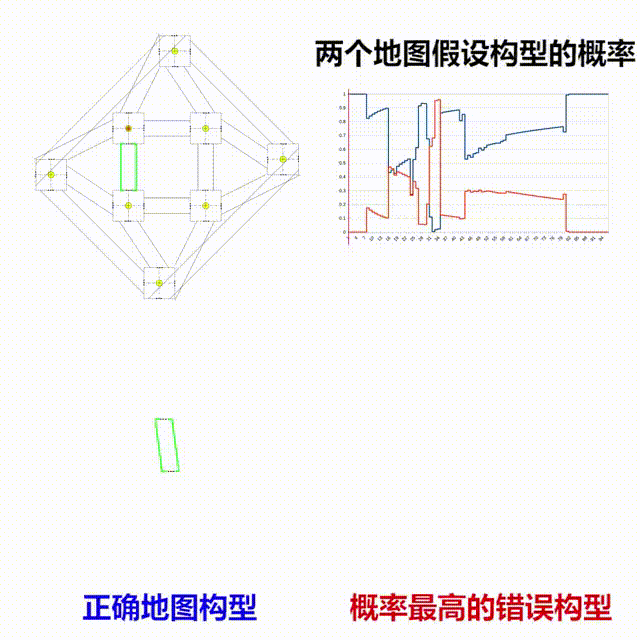
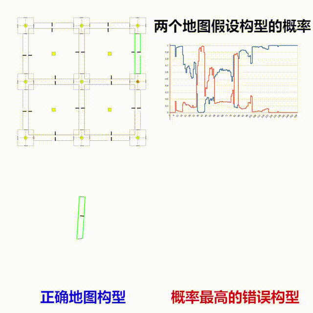

# 多假设拓扑地图建图算法

## 三个建图过程的例子
### 八点图

### 田字图

### 室内大尺寸环境

#安装
#### 将代码拷贝至catkin_ws的src文件夹下
    $ git clone https://gitee.com/stumbo/Tmapping.git
#### git clone 后首先进行编译
    $ catkin_make --pkg tmapping 
如果编译报错提示找不到qt之类的可以尝试以下命令

    $ sudo apt-get install qt4-dev-tools qt4-doc qt4-qtconfig qt4-demos qt4-designer
还不行的话

    $ sudo apt-get install ros-$ROS_DISTRO-qt-*
#### 编译完成后, 打开建图核心
    $ rosrun tmapping main
#### 打开图形界面
    $ rosrun tmapping UI

# 快速开始
## 简单模拟
#### 把demo地图放到指定位置
将文件夹`demoMaps`里的基本地图文件复制到在`/home/${USER}/tmappingMaps`中
#### 打开建图核心以及UI
    $ rosrun tmapping main
    $ rosrun tmapping UI
#### 读取地图并放置机器人
在打开的界面中, 点击左侧 `Load` 读取 demoMap, 切换至 `Simulation mode`, 点击`Connect to ROS
`, 点击选中图中的一个节点(会被绿色高亮). 再点击左上角 `Place Robot at node`.
#### 移动机器人
随后按住 `ctrl`, 鼠标右键点击路口, 机器人会随之移动, 同时向核心发建图信息
#### 查看建图结果
切换至 `realtime mode`, 点击 `get maps`, 选择对应排名查看要观察的建图结果

*可以打开另外一个UI, 一边模拟一边看建图结果, UI支持多连接 (ros::init_options::AnonymousName)*

## 大规模测试模拟
#### 重置建图core核心:
    $ rosservice call /tmapping/srv/reset
回到 `Simulation mode`, 选中 `move until coverage`, 点击 `Random Move`, 则机器人会随机移动, 直到覆盖整个地图

此外还可以进行大规模测试,  选择需要的测试数量 `trials`, 再点击 `Start massive trials`,
测试完毕后会统计建图正确率和所需的步数

#### 保存某次随机建图的图像
随机移动过程中, 会记录建图的走向图, 在随机建图完毕后, 可以按`ctrl+R`输出过程中的图片, 
输出文件于tmappingMaps的子文件夹中
(这个功能是最后为了可视化加上去的, 会影响一定的效率, 如果需要删除请查找和`TmapUI::routeImgs`有关内容)

## 使用实际数据
#### 打开建图核心以及转换器
    $ rosrun tmapping main
    $ rosrun tmapping converter_LocalSSH

#### 然后在 `/features_in_last_map` topic下发布你的信息
topic名字在`LocalSSH`的构造函数中

#### 保存建图结果
##### 方法1: 调用核心的service
    $ rosservice call /tmapping/srv/saveChampionMap
目前只能保存第一名的地图(但改起来也很容易)

会保存在 `/home/${USER}/tmappingMaps` 下, 名为`currentChampion_YYYYMMDD_HHmm`
    
##### 方法2: 从UI选择要保存的地图
启动UI

    $ rosrun tmapping UI
顶部切换至 `realtime mode`, 点击 `Connect to ROS`, 再点击左侧的 `get maps`, 选择你要保存的地图, 最后 `ctrl+S`

会保存在 `/home/${USER}/tmappingMaps` 下, 名为`result#_YYYYMMDD_HHmm`

#### 查看建图结果
保存的都是json格式的地图文件, 可以在UI中的 `build mode` 下读取查看

#### 可视化和自动化处理
保存Qt已绘制的图像的API操作方式可以至`TmapUI.cpp` 中搜索 `case Qt::Key_T:`

想要自动化请自行搭建实时的保存机制 :-)  可以部分参考 `case Qt::Key_R:`

#图形界面介绍
UI中有三个模式, 建图模式, 模拟模式和实时模式, 单击界面顶部的按钮进行切换
## 建图模式
打开后首先进入的是建图模式, 左侧的Map Builder工具栏负责构建拓扑地图, 右侧的Exp Builder负责生成拓扑节点.
#### 将地图文件放到对应的位置
将文件夹`demoMaps`里的基本地图文件放在`/home/${USER}/tmappingMaps`中, 
`tmappingMaps`可以在`include/tmapping/tools/TopoParams.h`中设置,变量名为`TMAP_STD_FILE_SAVE_FLODER_NAME`
### Exp Builder工具栏
之所以将拓扑节点称为Exp, 是因为对于机器人的探索而言, 每次经过拓扑节点就是对节点的一次观测, 生成的是一次经验(exp).

#### 生成以及保存节点
单击`Load`按钮便可以读取已经在`tmappingMaps`中保存的节点. 单击`Save`则是按照输入的名字进行存储.

#### 将节点的复制品加入地图
单击 `Add a copy to map` 将 `built ones` 选中的节点加入拓扑地图中.

单击 `Edit Json` 可以直接编辑对应的节点的原始Json信息, 再次点击 `Complete Editting` 则完成修改.

#### 制作全新的节点
首先在`Exp Type`选择要创建的节点类型, 目前仅有路口`Intersection`和房间`Room` 两个选项.

然后在 `Exp Size`选择节点的大小, 会提供一个正方形供你进行初步的绘制, 这个size表示的是正方形的边长.

点击 `Build an Exp` 开始绘制, 主界面的右下角会出现一个5x5的圆圈方阵(方阵对应的实际尺寸就是前面设置的Exp Size), 
用鼠标左键单击圆圈开始制作节点的组成Gate, 拖拉方向选择Gate的朝向, 松开后Gate便被添加. 右键单击圆圈则添加地标LandMark.

在 `Gate Type` 选择要添加的Gate类型.

在 `LM Name` 选择添加地标的名称

    5x5方阵的对应代码在`ViceGView::beginExpBuilding`最后的for循环中
    
    设置Gate法向量时, 朝向是被限制的, 这一步操作的执行体现在`ViceGView::mouseMoveEvent` 和 `ViceGView::mouseReleaseEvent
    ` 中对`changeNormalVec()`的调用方式上, 限制方向的策略则在`TopoVec2::restrictDir()`
    
    但是不建议修改策略, 而是制作好后对Json直接进行微调

### Map Builder工具栏
点击`Load`按钮便可读取对应名称的地图文件, 默认是demoMap.

点击 `Add Gate to Corridor` 可以在走廊上绘制一个打开的门. 操作方式也是鼠标左键点击拖动. 这个门沿走廊的位置会被限制为0.5的整数倍.
对应逻辑在 `MainGView::mousePressEvent` 的第二个else if分支, 搜索 `mAcceptAddingGate2Corridor`

点击 `Edit Json of Selected Node` 可编辑已经在地图中的拓扑节点, 首先需要选中节点(选中的节点外框会变绿). 
编辑后再次点击 `Complete Editting` 则完成替换. 按 `J`可以达到一样的效果 *注意, 这里没有联动地更改节点之间Gate的连接关系!*
 
点击 `Delete Selected Nodes` 则可以删除选中的节点, 按`delete`或`d`可完成相同的效果. 

点击 `Connect Gates` 可以连接节点之间的Gate. 使用鼠标拖拉即可. 鼠标悬浮到空悬的Gate时会出现红圈的提示. 按下连接到另一个Gate松开便完成了连接.

如果 `Using Corridor to Connect` 被选中, 则绘制出的会是一个新的走廊节点, 此时走廊可以空悬至另一个单独位置, 而不一定需要连接第二个Gate

`Enable nodes moving` 选中后允许鼠标拖动来移动拓扑节点

`Restrict nodes to grid` 选中后节点会限制在整数倍的位置上(以节点坐标系的0,0为准), 方便对齐

最下方的下拉菜单用于选择节点的移动策略:

* `Every Node Follows` 所有连接的节点都会跟着被移动的节点走, 对于路口和房间而言这看起来就像是固连的, 但对于走廊而言, 走廊会改变其形状来满足你的移动

* `Only Fixed Rooms Follow` 和前一个基本一样, 只是走廊不再跟随, 连接会断开, 出现一条虚线 `fakeLine` 来表示连接关系

* `No Nodes Follow` 没有节点会跟随, 断裂的连接会由一条虚线 `fakeLine` 来表示连接关系

## 主界面

前面提到了节点可以移动, 其中的连接关系会用虚线`FakeLine`表示, 虚线也是可以被删除的. 选中节点后再按`shift + D`会删除这个节点相关的所有 `fakeLine`

选中`fakeLine` 后, 按 `D` 可以删除之, 对应的Gate会相互连接, 远离红色端的节点会在红线位置与近红色端的节点连接.
如果想要相反操作, 按 `shift+D` 便可.

按住`ctrl`的同时使用`滚轮`可以缩放, 如果地图过大, 单击界面顶部的`enable Drag`按钮则可拖动界面.

双击节点可以查看节点的原始`Json`信息

## 模拟模式

在roscore已经在运行的情况下, 单击 `Connect to ROS`可以和roscore建立联系(此操作不可逆)

### Simulator 工具栏
首先选中地图中的一个节点, 单击 `Place robot at node`, 便可放置机器人(此操作不可逆), 机器人通过一个红圈表示.

`no detailed moving` 指机器人是否控制机器人在节点内的详细移动.

在主界面中, 在节点中对应的Gate和LM上按`右键`可控制机器人在节点内移动, 这代表着机器人对节点中特征的观测顺序(没有点到的相当于没有观测到).

按住 `ctrl` 再按右键可以让机器人穿过对应的Gate离开节点进入下一个节点. 此时如果已经连接ROS, 会通过对应Service发送观测信息.

如果 `accidents can happen`被选中, 则机器人运动过程中将会有概率丢失一个节点的特征点. 对应的概率默认为25.

#### 添加噪声
可以添加模拟噪声, 位置和角度, 其中的设置项表示的是最大值 (因为几何哈希算法不能忍受严重的误差), 角度误差为均匀分布, 
位置的误差比较复杂, 是两个高斯分布的组合, 同时节点内特征点之间的噪声不是完全独立, 位置越近, 其噪声就越相似, 
具体代码在 `ExpData::addNoise()`

#### 大规模测试模拟器

点击 `Random Move`, 机器人会按照`Steps`的设定步数开始随机运动. 如果`move until coverage` 被选中,则会持续随机运动, 直到整个地图被覆盖.

选择 `Start massive trials` 则会开始自动测试. 随机运动, 完整地建图 `trials` 次. 并统计建图的成功率, 结果会显示在终端中.

## 实时模式

可以实时获取建图核心的建图结果

### RealTime 工具栏

单击 `get maps` 从建图核心获得当前概率最高的n张地图, 地图假设以及其概率会显示在下拉菜单中, 选择后查看具体构型

单击 `show the poss history` 可以查看当前显示地图的概率变化历史, 
显示两列, 第一列为当前地图概率变化, 第二列为除了其构型之外的最高概率构型的概率. 
会显示在终端中, 方便复制出来在excel中绘图

`survivor maps` 可以设置核心中, 地图构型的数量限制(超过的会剔除), 只要改动数值就会立刻设置

`Enable Nodes Moving` 选中后可以移动地图中的地图构型, 这在地图构型杂乱的时候很有用, 移动的策略是 `No Nodes Follow`

#快捷键

|快捷键|功能|
|---:|:---|
|选中节点 + `D`|删除节点|
|选中节点 + `shift+D`|删除节点的所有 `FakeLine`|
|选中虚线 + `D`|删除`FakeLine`|
|选中虚线 + `shift+D`|删除`FakeLine`, 但反方向移动节点|
|`ctrl+S`|实时模式下保存地图|
|`V`|复制选中的节点并添加|
|`J`|编辑选中节点的原始`Json`数据|
|`C`|建图模式下开启连接模式|
|`F`|开始机器人的随机移动|
|`G`|实时模式下获取当前的已建地图|
|`ctrl + R`|绘制上一次随机移动过程的图像|
|`M`|融合两个节点数据|
|`T`|保存当前主界面的图像为 test.png|

# Converter
一个简单的从Feature到Exp信息的转换节点, 在 `src/converters/Converter_LocalSSH.cpp` 中
转换的callback在 `LocalSSH::cbFeatures()` 中.

# 参数

主要3个参数需要调整, 都在 `include/tmapping/tools/TopoParams.h` 中
* `stdErrPerMeter` 算法预估的里程计标准差, 默认为0.1, 即每走一米产生噪声的标准差是多少
* `maxErrForGeoHash` 哈希表所预估的最大里程计误差, 默认为0.4, 再增加会降低算法效率, 而且可能会产生错误匹配映射
* `maxMapNumberPerStep` 每一步保存的最多地图构型数量, 增加后会增加建图成功率, 但会消耗计算时间, 
且为了达到肉眼可见的效果需要大幅增加并且需要大量的探索